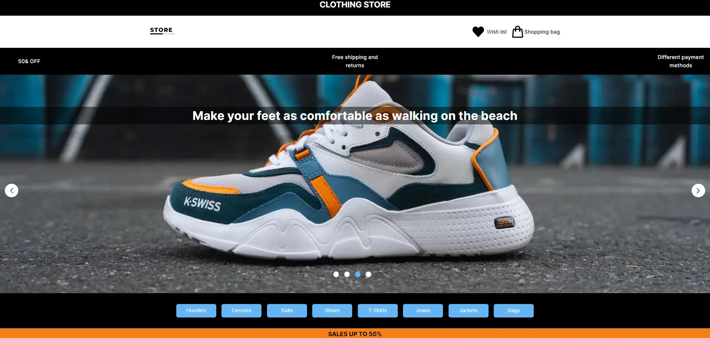
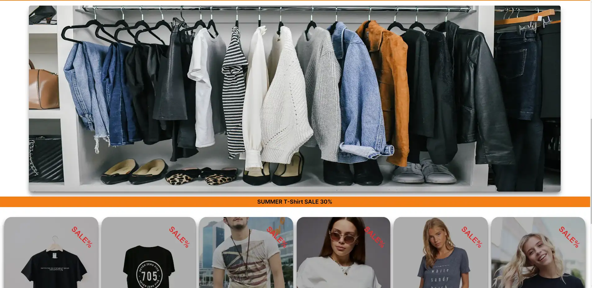
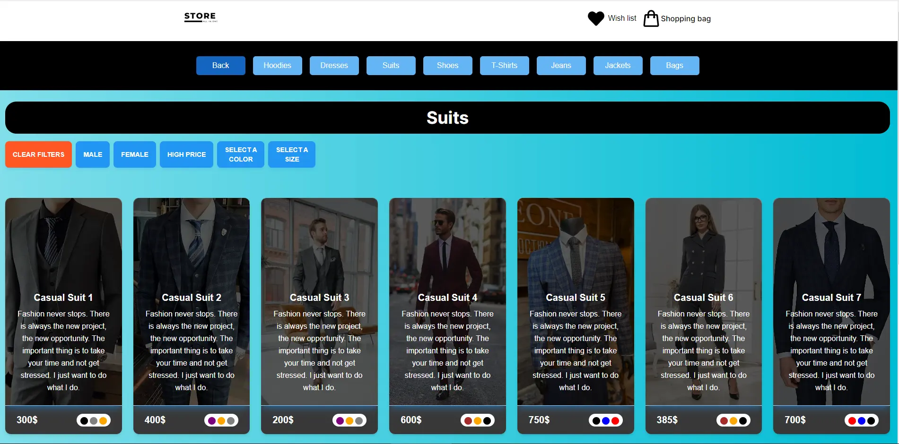
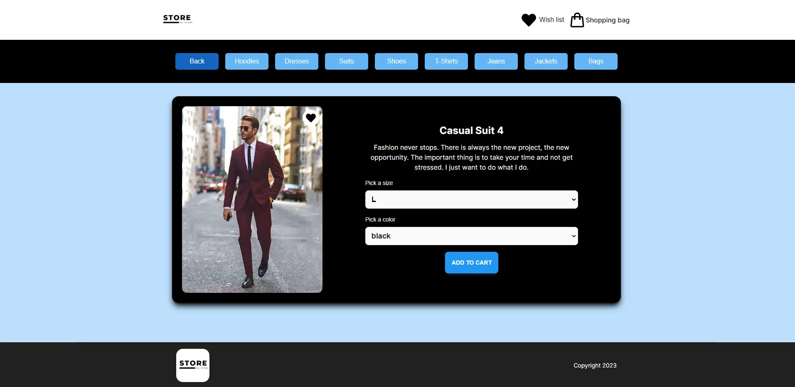
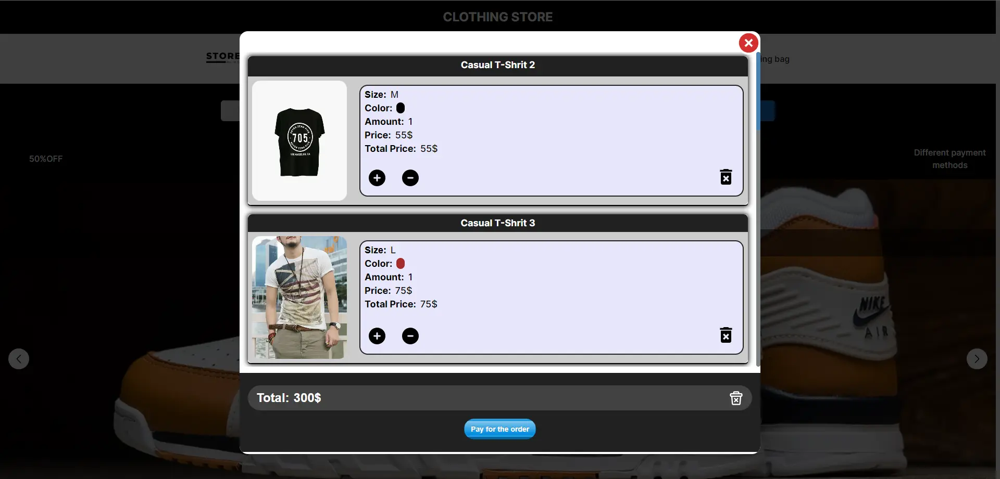
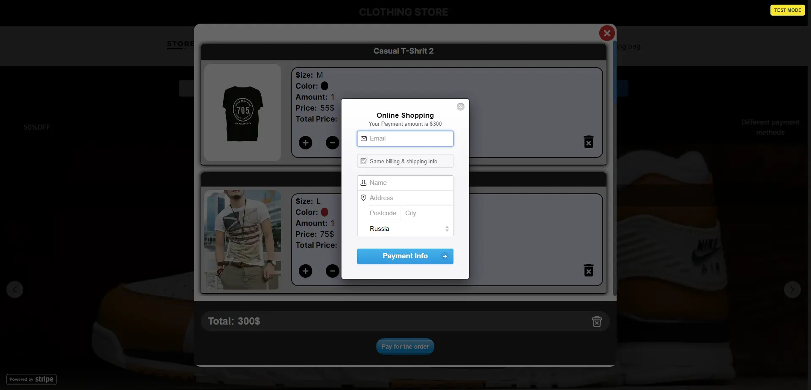

# Getting Started with Create React App

This project [Demo](https://konstvb-rep.github.io/clothing_store).

This project was bootstrapped with [Create React App](https://github.com/facebook/create-react-app).

## Available Scripts

In the project directory, you can run:

### `npm start`

directory <i>./server  

### `npm start`

Runs the app in the development mode.\
Open [http://localhost:3000](http://localhost:3000) to view it in your browser.

The page will reload when you make changes.\
You may also see any lint errors in the console.

Used by the library:

    -react-router-dom;
    -@headlessui/react;
    -tailwindcss;
    -@reduxjs/toolkit;
    -redux-persist;
    -@material-tailwind/react;
    -react-icons;
    -react-stripe-checkout;
    -antd;

